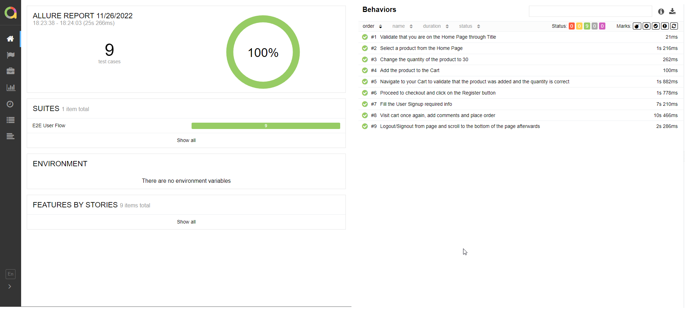

---

Automation Test for Apply Digital Automation role to cover the [following document requirement](https://drive.google.com/file/d/1Y1pWje9niI1RuPvxzYvAxGAOtTSeRBo_/view?usp=sharing).

## Tech Stack used
**Automation Framework**: Cypress

**Language used**: Typescript with a little bit of JS as well (For a pesky CSRF token control that was bugging me on the actual login/signup process)

**Pattern used**: Basic Page Object Model, nothing related to BDD/Gherkin whatsoever as it wasn’t needed.

**Reporting**: Used Allure for better visualization, although it’s just a simple spec file, it helps to visualize the different steps from it

## :wrench:**Installation**

1. Clone this repo to your local machine
2. Open the cloned repo with your favorite IDE (I'd encourage you to use VSCode above all else, but that's up to you :smirk:)
3. Open your terminal and type: **`npm init`** (Wait for a while since it can take some time due to Cypress installing emulated browsers as part of the process)

And that should be all... **Hopefully**

---
## :construction_worker:**Usage**
- In order to run some tests, you should first pay attention to the commands to call the tests, those commands are defined at the _**package.json**_ file at the *"scripts"* section, but overall you have 2 options to run your tests:

    **1.-** **`npm run cy:e2e`**: This commend will run them directly through the Cypress GUI and then will allow you to pick the only :sweat_smile: spec file available _(Pretty silly isn't it? haha :stuck_out_tongue_winking_eye:)_

    **2.-** **`npm run test:allure`**: My recommended and more fancy way to run this is to use Allure Reporter and get to see their beautiful reports, videos of the execution and a pretty good summary of the run itself _(this will first run the tests and then generate the reports, since it chains two commands into one for ease of use)_

> **NOTE** It's important to mention that since this automation project barely needs 1 general flow of user actions, it will look kinda silly as well, but at least it helps to visualize things in a different way of the standard Cypress GUI which is mostly intended for debugging purposes.*
---
## :eyeglasses:_**OPTIONAL**: Diving into Allure Reports if needed_
We use Allure report for a better looking reporting, but in order to actually run it locally there are some considerations that you need to have, so here we go:
1. Allure will come along with all the packages that will be installed with `npm init` which will allow you to run the commands to generate the allure report (*`npm run test:-allure`*) nevertheless if you just execute this command, you'll get a bunch of *.json* files in the *allure-results* folder but not the actual "viewable" report.
2. To be able to view the report in HTML or through your browser, you should first install `allure-commandline` for this I strongly recommend you to visit the following page (https://www.npmjs.com/package/allure-commandline) to actually get the proper instruction according to your system.
3. After you have effectively installed allure-commandline it's time to execute the command/s through the terminal to actually visualize it, which could be two of possible options:
 * `allure generate ./allure-results --clean`  -> this command will generate the report from the actual json files from the *allure-results* folder.
 * `allure serve` -> this command will generate the report and open it up for you in the browser according the html file created at the *allure-report* folder (which will be created automatically).

After executing all of this, you'll come up with a report that will look like this:

---
## :green_book: Additional Information and References

**Cypress Docs**: https://docs.cypress.io/guides/end-to-end-testing/testing-your-app

**Allure Main Docs**: https://docs.qameta.io/allure/

**Allure Cypress specific**: https://www.npmjs.com/package/@shelex/cypress-allure-plugin